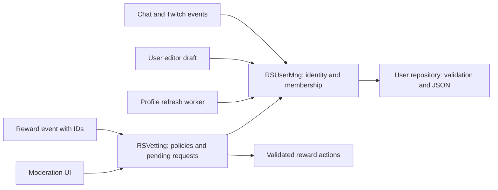

# Known users and vetting review

Reviewed 2026-09-25, against commit `de0e9f1`. This is an investigation and proposed plan; application code has not been changed.

**Recommendation: fix the concrete defects first, then incrementally refactor ownership and vetting.** The ID-based user cache, profile refresh queue, and JSON storage provide a useful foundation. A complete rewrite is unnecessary, but isolated fixes alone will leave the shared-state and identity problems in place.

## Current behavior

| Concern | Current owner and behavior |
| --- | --- |
| Observed identity | `RSUserMng.observe_user()` creates/reuses an `RSUser` by numeric Twitch ID. Observed users stay in `unknown` until saved. |
| Known membership | `save_user()` both persists a record and adds it to `known`. Manual search and `!add_me` can add users. |
| Lookup | ID dictionaries plus a normalized username index. Known users return immediately; unknown users may require profile and color requests. |
| Persistent profile | One JSON document per user, named `<id>_<username>.json`, containing Twitch fields, local preferences, games, and totals. |
| Profile synchronization | Delayed batches, retry/backoff, authentication pause, and explicit manual refresh. |
| Local editing | Panels directly mutate the same objects held by the manager; some changes save immediately, others rely on Save or shutdown. |
| Vetting | Separate JSON dictionary keyed by username, with reward-title decisions and a warning count. Pending requests exist as notification widgets carrying callbacks. |
| Statistics | Summary manager observes users by ID and commits lifetime totals only for known users, with a summary ID to avoid applying the same rollover twice. |

`known` currently means “saved in this application.” It does **not** establish a separately reviewed trust level. However, impersonation uses known membership as its target allowlist.

## What works and should be retained

- **Stable primary identity:** observation reuses the existing object for a Twitch ID, and merely observing a viewer does not add them to the known list. Normalization and ordinary same-ID renames update the username lookup correctly. These behaviors were checked locally.
- **Explicit profile fields:** `update_from_twitch_user()` updates Twitch profile fields without overwriting promotion settings, games, or interaction totals.
- **Useful refresh controls:** startup delay, bounded batches, retry limits, rate-limit handling, authentication pause, and manual refresh already exist. The refresh worker compares the original object after HTTP completes to avoid overwriting a replacement or restoring a removed member. These are source-reviewed safeguards, not a fully exercised network test suite.
- **Safer file writes:** `RSUtl.save_to_json()` writes and flushes a temporary file before replacing the destination, and returns failure. Renamed user files are cleaned up only after the new write succeeds.
- **Basic storage recovery:** top-level invalid user records are skipped; duplicate IDs are selected deterministically by modification time and sorted filename order.
- **Basic vetting flow:** unmatched requests go to moderation, stored `ACCEPT_ALL` executes automatically, and stored `DECLINE_ALL` suppresses execution. An ordinary acceptance is not saved as a permanent permission. Warnings are informational counters; there is no automatic warning threshold.
- **Some duplicate protection already exists:** Twitcher's EventSub layer filters repeated message IDs. The separate absence of a consumed moderation-request state should not be mistaken for an absence of all event deduplication.

Sources: [RSUserMng.gd](../classes/RSUserMng.gd), [RSUser.gd](../classes/RSUser.gd), [RSUtl.gd](../classes/RSUtl.gd), [RSSummaryMng.gd](../classes/RSSummaryMng.gd), [EventSub](../addons/twitcher/eventsub/twitch_eventsub.gd).

## Findings, ordered by impact

### 1. User rollback can fail and discard Steam associations — high priority, reproduced

`RSUser.to_dict()` creates integer Steam keys (lines 90–92), but `update_from_dict()` iterates them as `String` after first clearing `steam_app_ids` (lines 201–209). Loading actual JSON works because JSON object keys are strings. Restoring the direct in-memory dictionary does not.

**Reproduction:** create a user with one Steam game, then call `RSUser.from_json(user.to_dict())`. Godot reports an int-to-String assignment error at line 206; the resulting user has no Steam games and decoding stops partway through.

This affects a live safeguard: `RSUserMng._refresh_profile_batch()` restores `before` with `original.update_from_dict(before)` if saving refreshed data fails (lines 374–378). With Steam games present, that rollback can clear games and abort before restoring later fields.

**Action:** make decoding accept both dictionary key representations, define one canonical snapshot format, and verify complete round trips with populated nested data. Construct and validate replacement data before mutating a live object.

### 2. Vetting decisions follow names instead of identities — high priority, reproduced

`RSVetting` uses `data.username` and `data.reward_title` as keys (lines 21–35 and 79–104). `RSTwitchEventData` already retains the user ID, but discards reward and redemption IDs (lines 43–49).

**Reproductions:** the same ID under a new login gets a new entry with no warnings or saved permission; a different ID supplied with the old login inherits its permission. A renamed reward similarly stops matching the old policy. A newly configured reward with a reused title can match an unrelated old decision.

**Action:** store policies by user ID and reward ID, scoped to the broadcaster if settings/data can be reused across channels. Keep names and titles only as display metadata. Retain redemption IDs for request tracking. This needs a small schema migration, not just normalization.

### 3. UI editing has no reliable commit boundary — high priority, source-confirmed

Promotion and customization panels mutate the manager's live `RSUser` directly. `save_user()` cannot undo those mutations if disk writing fails, and most UI callers ignore its Boolean result. An unrelated background profile save or shutdown can persist edits that the user never explicitly saved.

There is a particularly concrete case in [pnl_user_games.gd](../instances/users/pnl_user_games.gd): `_populate()` calls `add_itchio_entry(..., false)`, but `add_itchio_entry()` ignores the `save_user` flag and always saves (lines 127–150). Merely displaying a user's itch.io games writes the entire user record. The equivalent Steam path honors the flag.

The game functions also await a fetch and then use the panel's current `user` and shared result fields. Selecting B while adding a game to A can make the continuation save to B. If the selected object was deleted during the request, a later save can add it back because saving also grants membership.

**Action:** fix the ignored flag and capture/check the target ID across awaits immediately. Then use an editor draft and one validated manager commit, or an explicit autosave model with visible save failures. Separately expose membership addition; updating a deleted user must not silently re-add them.

Sources: [pnl_user_promo.gd](../instances/users/pnl_user_promo.gd), [pnl_user_customization.gd](../instances/users/pnl_user_customization.gd), [pnl_user_games.gd](../instances/users/pnl_user_games.gd), `RSUserMng.gd:104`.

### 4. Impersonation approval does not validate a complete executable request — high priority, partly reproduced

`RSVetting.is_allowed()` only checks whether the first input token names a known user (lines 62–76). `RSCustom.impersonate_iRad()` assumes both a target and a message exist, and dereferences the target without checking for null (lines 199–207).

**Reproduced:** a known username alone passes vetting, but produces only one input token; execution accesses token `[1]`. If a target is removed or renamed while a notification waits, acceptance can instead encounter a null target. `receive_response()` does not repeat eligibility validation. The gate and executor also use different split options.

**Action:** parse once into a validated target ID and nonempty message. Store that request, and recheck target eligibility before execution. Display a useful rejection reason rather than only logging or failing inside the callback.

### 5. “Known” doubles as an impersonation permission — policy decision, source-confirmed

`!add_me` is registered without an explicit elevated permission in `RSCustom.gd:32`; its handler saves the caller immediately (`RSUserMng.gd:406`). The impersonation target check accepts any known username, regardless of `is_streamer` or a separate permission.

If known membership is intentionally self-service, this is consistent with the implementation. If it is intended to mean an operator-approved impersonation destination, it does not enforce that intent. Removing someone also does not prohibit them from using `!add_me` again.

**Action:** define membership separately from `allow_impersonation_target` and, only if needed, a membership block policy. Do not silently turn every existing known user into a trusted user during migration.

### 6. Vetting administration looks editable but does not persist edits — medium priority, source-confirmed

[pnl_vetting.gd](../instances/settings/pnl_vetting.gd) creates reward dropdowns without change handlers and displays a warning SpinBox without a connected persistence handler. The scene only connects the Reload button. Reload repopulates the displayed list; it does not reload the file. `RSVetting.clear()` is unfinished.

**Impact:** changing a permission or warning count in the settings UI does not change moderation behavior. There is no completed route to reset a stored decision back to “ask.”

**Action:** implement service methods for setting/removing a decision and editing warnings; connect controls and show save results. Refresh the selected details when the service changes, not just the list of names.

### 7. Vetting load/save failures are not handled — medium priority, source-confirmed

`load_user_vetting_list()` assigns arbitrary parsed JSON directly to a Dictionary; invalid JSON or the wrong shape is not validated. Nested `warnings` and `rewards` are subsequently accessed unconditionally. `save_user_vetting_list()` discards the writer's Boolean result and logs success unconditionally (lines 108–114).

An `ACCEPT_ALL` decision executes before its persistence attempt. A failed save leaves the operator with a decision that works in memory but disappears after restart. A saved decline or warning has the same persistence uncertainty.

**Action:** validate/version the document and individual records, preserve malformed input, and return explicit results. Report whether a decision was executed and whether its future policy was saved; those are separate outcomes.

### 8. Pending moderation is owned by widgets rather than the service — medium priority, reproduced guard gap

The notification holds the callback and input. `receive_response()` has no request ID or pending/consumed check. Calling acceptance twice executes twice; the isolated check reproduced this. `queue_free()` on the widget is not a service-level execution guarantee.

Queued notifications keep the warning count from creation. Setting `DECLINE_ALL` on one request does not resolve other pending notifications for that user/reward, and those can still execute if accepted. Pending requests vanish when the notification panel resets or the application exits. None of this is represented explicitly as request state.

**Action:** have `RSVetting` own requests keyed by redemption ID and consume each decision once. Widgets submit a response by ID. Define whether policy changes affect existing requests and how long requests remain valid. Persistence of pending requests is optional; explicit cancellation on restart may be sufficient.

Sources: [notification_vetting_reward.gd](../instances/notification_vetting_reward.gd), [pnl_notifications.gd](../instances/pnl_notifications.gd), `RSVetting.gd:79`.

### 9. Reload has the wrong path and would create a second live object — medium priority, path contract reproduced

`get_filename_from_user_id()` returns a basename (`RSUserMng.gd:480`). The Reload handler passes it straight to `load_user_from_json()` (`pnl_rs_user.gd:47`), so it does not open the file in the user folder.

Simply joining the folder fixes the immediate error, but loading then replaces only the panel's reference. The manager retains the old object until Save, and the helper chooses the first matching filename rather than using startup's newest-file rule.

**Action:** expose `reload_user(id)` on the manager, resolve the same authoritative record used at startup, validate it, update the canonical object, and notify observers. Handle failures without clearing the selected user.

Source: [pnl_rs_user.gd](../instances/users/pnl_rs_user.gd).

### 10. Conversion and legacy merge contracts are inconsistent — medium priority, reproduced

- `to_twitch_user()` passes a dictionary with `username` to a decoder expecting `login`, then fills only `id` (`RSUser.gd:140`). The converted login is empty. This object is used by impersonation and context-menu shoutouts; ID-only downstream operations may still work, but the conversion is incomplete.
- `update_from_dict()` only assigns `custom_beans_params` when the value is a Dictionary; explicit null does not clear an existing value (`RSUser.gd:229`).
- `update_with_user()` treats defaults as partial updates inconsistently: it ignores all Boolean changes and empty strings/arrays, but accepts empty dictionaries and float zero (`RSUser.gd:158`). The check reproduced erasure of games and replacement of `added_on` by zero. **Only the old editor test was found calling this method**, so this merge defect is currently latent rather than evidence of the normal profile refresh overwriting preferences.

**Action:** map Twitch fields explicitly; define full replacement versus field patching; support explicit clears. Remove the unused heuristic merge or replace it only if a real caller needs it.

### 11. Storage accepts conflicting identities and hides bulk failures — medium priority, source-confirmed

Loading trusts the ID inside JSON, while cleanup/deletion identifies files by filename. A file named `999_name.json` containing ID `101` loads under 101, but deleting 101 will not remove that file; the record returns on restart. Top-level validation also does not validate nested games/customization fields before constructing typed objects.

Duplicate records are resolved by file modification time, not by merging local settings. That is deterministic, but externally copied files can become the winner regardless of which content the operator intended to keep. Delete can partially remove duplicate files before a later removal fails. Bulk save ignores per-user failure, including during shutdown.

**Action:** use one canonical `<id>.json` path, validate filename/content agreement during migration, retain conflicting files for review, and report load/save/delete outcomes. No database is required for this scale solely to fix these issues.

Sources: `RSUserMng.gd:123`, `:420`, `:442`, `:446`, `:470`; [RS.gd](../RS.gd), line 83.

### 12. Refresh and live-state consumers need terminal outcomes — medium priority, source-confirmed; network paths not reproduced

`refresh_known_user()` waits for its ID's completion signal. Authentication failure only completes the IDs in the active batch, while other queued callers remain waiting until authentication resumes. There is no manager-level deadline/cancellation for those waits. Refresh buttons awaiting them can remain disabled.

The bundled [HTTP client](../addons/twitcher/lib/http/buffered_http_client.gd) also warrants a focused fix: its connection/TLS retry callback binds an `HTTPRequest` where the receiving function expects `RequestData` (line 185), and the retry-limit branch returns without a terminal completion signal (lines 172–174). It additionally falls through to publish the failed response after scheduling a retry. The manager's retry policy should not be assumed to make these dependency paths reliable.

Live stream lookup returns an empty or partial dictionary after errors (`RSTwitcher.gd:252`), and the manager replaces the previous live list unconditionally (`RSUserMng.gd:152`). A temporary failure can therefore look like everyone went offline. Unlike profile refresh, live refresh does not filter out users removed while awaiting its result.

**Action:** require exactly one terminal result per request, distinguish paused/cancelled/failed work, and let waiting UI recover. Return live data with success/staleness metadata and recheck current membership before applying it.

## Refactor scope

| Component | Recommendation |
| --- | --- |
| `RSUser` | Keep as the user record. Fix serialization and explicit update semantics; standardize defaults across observation, Twitch conversion, and disk load. |
| `RSUserMng` | Keep as the public entry point. Make it the owner of identity and membership; stop exposing mutation as an incidental effect of saving. |
| User storage | Extract validated load/save/delete and migration into a small repository class with explicit results. Retain JSON initially. |
| Profile refresh | Extract the existing queue after behavior is covered, preserving its useful batching and retry controls. |
| `RSVetting` | Refactor more substantially: stable policy keys, validated requests, request lifecycle, explicit outcomes, and migration. |
| UI | Submit edits/decisions to services and display their outcomes. Keep temporary edits outside canonical records. |

Suggested boundaries:

One canonical object per ID is worth keeping for existing observers. Commits should validate and persist a candidate, then copy committed fields into that object and emit one meaningful update. Separate operations such as `add_known_user`, `update_preferences`, `reload_user`, and `remove_known_user` make membership effects explicit.

Avoid splitting every field into a separate class immediately. The valuable boundaries are identity, persistence, asynchronous refresh, and moderation lifecycle.

## Suggested implementation order

1. **Stabilize behavior:** fix snapshot decoding, login conversion, explicit null clearing, Reload path, itch.io display writes, async editor target checks, impersonation parsing, and visible save errors. Add focused regression cases for these actual failures.
2. **Define user commits:** choose draft-and-save versus explicit autosave; centralize writes, reload, and membership changes; make deletion invalidate pending edits and refresh results. Preserve existing profile refresh behavior.
3. **Migrate vetting:** retain user/reward/redemption IDs, version the file, introduce service-owned requests, and wire administration controls. Settle target permission and pending-policy semantics explicitly.
4. **Simplify internals:** extract storage and refresh classes, remove unused heuristic merging, and reduce direct dictionary access. Optimize only after correctness is stable.

Migration must preserve originals and produce a reviewable mapping. Old vetting entries contain no IDs, so a current login lookup alone cannot prove which historical account earned an old permission. Resolve against trustworthy existing records where possible; leave ambiguous entries inactive and visible for operator review. Do the same for reward titles that cannot be mapped unambiguously. Keep moderation policy when removing known membership unless an explicit separate purge is requested.

## Verification and limits

The review traced the three requested classes, storage utilities, event conversion, reward dispatch, summary integration, user/settings panels, notification lifecycle, and relevant Twitcher code. The existing `test/user_update_test.gd` prints merge results but contains no assertions and does not exercise the manager or vetting lifecycle.

An isolated Godot 4.7.2 diagnostic ran **15 checks**. Fourteen matched the observed current behavior, including both working safeguards and reproduced defects. The remaining check deliberately exercised the expected in-memory Steam round trip and **failed**, with the type error described in finding 1. These are investigation probes, not a passing regression suite.

The diagnostic and output are in `.godot/known_users_review.gd` and `.godot/known-users-review.log`; fixtures and redirected application data are under `.godot/known-users-review-data`. The process used isolated `APPDATA`, did not start the main application/services, did not connect to Twitch, and did not modify the real user database. Godot also reported certificate-store access and shutdown resource-leak messages; these limit any claim of a clean whole-application run but do not account for the directly reported conversion/type results.

UI click flows, HTTP failures, auth recovery, disk-full behavior, and existing production records were not exercised. Findings labeled source-confirmed describe reachable code paths; they do not claim those failures have occurred in the user's stored data. Before implementing a migration, add controlled cases for duplicate/malformed records, deletion during awaits, failed persistence, policy changes while queued, and auth/transport cancellation.
